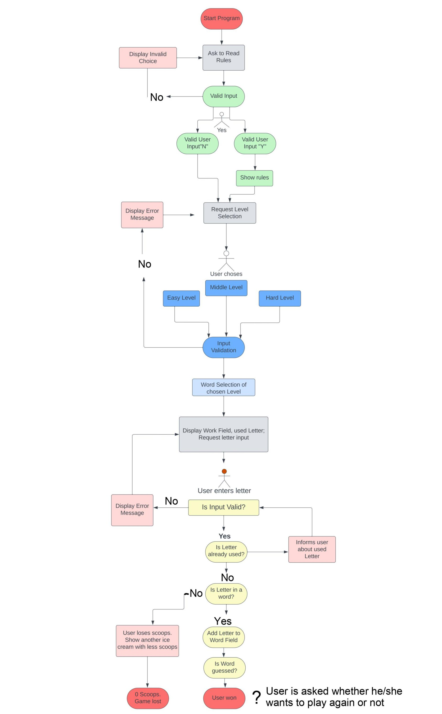

# Six Scoops
Six Scoops is a terminal-based alternative to a hangman game for kids. This game combines learning with fun. The player tries to guess a word letter by letter before running out of six scoops of ice cream. It is told the player that it is very hot and it is a good idea to get an ice cream. Playing this game is an effective way to encourage kids' interest in learning English. While playing this game, kids will learn easy vocabulary about summer. The words contain 3 to 5 letters and are appropriate for young learners.

[Link to live site]()

## Planning

The following flowchart is created with [lucidchart](www.lucidchart.com). It visualizes the planning process for this application. Also, it was added in PDF editor.

## Design

## User Stories

## Features

## Technologies Used

## Bugs

## Testing

## Deployment

## Credits

## Acknowledgements