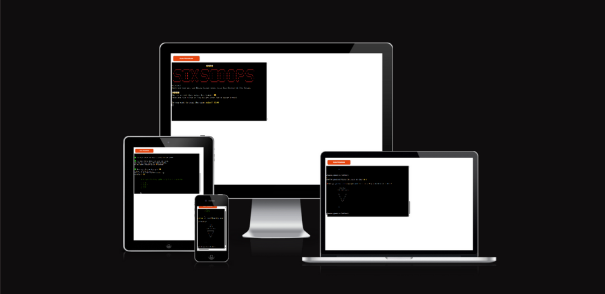
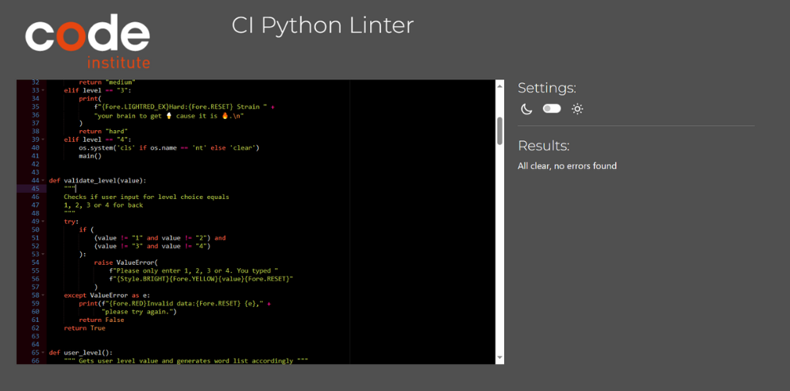

# Six Scoops
Six Scoops is a terminal-based alternative to a hangman game for kids. This game combines learning with fun. The player tries to guess a word letter by letter before running out of six scoops of ice cream. It is told the player that it is very hot and it is a good idea to get an ice cream. Playing this game is an effective way to encourage kids' interest in learning English. While playing this game, kids will learn easy vocabulary (100 words) about summer. The words contain 3 to 5 letters and are appropriate for young learners.

[Link to live site]()



---

## User Stories

**As a user I want to**

- be able to read an introduction when first loading the programm
- choose whether to read the rules to the game or not
- have a bit of time to read the parts of rules
- read the rules without introduction word in terminal
- choose a difficulty level
- be able to go back after choosing the level
- know how many scoops of ice cream I start off with
- be informed if my data input is not valid and how to solve this issue
- see which letters I have already guessed
- see the word being displayed for every correct guess
- be informed how many scoops I have left after a wrong guess
- see a graphic visualising my lost scoops
- learn the word to be guessed after losing the game
- see the full word displayed after completing the game successfully
- know when the game is over (won or lost)
- be able to play the game again after it is finished
- be able to restart the game

**As a site administrator I want to**

- be able to make upgrades to the game (add six letter words, create scoreboard)
- offer the user a short yet entertaining game

---

## Planning

The following flowchart is created with [lucidchart](www.lucidchart.com). It visualizes the planning process for this application. Also, it was adited in PDF editor.


---

## Design

As this is simple terminal based application, the design process for the user interface was limited.

Different colour choices  are used in order to highlight and categorise messages to the user.

For example, error messages are displayed in red or with the warning emoji, while guessed letters are displayed in bright yellow.

The word itself is displayed blue for every correct guess. 

If the word is not guessed, the user can see the secret word with the blue arrow emoji on the left.

Emojis are used in the introduction throughout the game because the game is for kids.

Ice cream graphic illustration was made by me.

As the kids do not like reading, I colored the important words in the questions or descriptions and put emojis near them.

---

## Features

### Existing Features

#Logo#

 - Displays game title using ASCII

 

#Introduction#
 
 

### Possible Future Features

 - The ```word_completion``` string looks like one line. And when the guessed letters joined it, letters sticked to each other. 
 To improve the text readability for kids, spaces between each underscore character can be added. 

 - Show the user not only which letters he has already guessed but also add a possibility to guess the whole word at once and show list of guessed words.

---

## Technologies Used

### Languages:

- [Python 3.11.5](https://www.python.org/downloads/): used to anchor the project and direct all application behavior

- [JavaScript](https://www.javascript.com/): used to provide the start script needed to run the Code Institute mock terminal in the browser

- [HTML](https://developer.mozilla.org/en-US/docs/Web/HTML) used to construct the elements involved in building the mock terminal in the browser
---
### Frameworks/Libraries, Programmes and Tools:
#### Python modules/packages:

##### Standard library imports:

- [random](https://docs.python.org/3/library/random.html) was used to implement pseudo-random number generation.
- [os](https://docs.python.org/3/library/os.html ) was used to clear the terminal before running the program and bevor showing the rules.
- [time](https://docs.python.org/3/library/time.html) was used to delay print statements.
- [string](https://docs.python.org/3/library/string.html) was used for string (ascii, emojis) manipulation
- [sys](https://docs.python.org/3/library/sys.html) was used to create a typewriter-effect animation for strings.
 
##### Third-party imports:

- [Colorama](https://pypi.org/project/colorama/) was used to add colors and styles to the project.

#### Other tools:

- [VSCode](https://code.visualstudio.com/) was used as the main tool to write and edit code.
- [GitHub](https://github.com/) was used to host the code of the website.
- [Canva Pro](https://www.canva.com/) and [bigimage](https://bigimage.11zon.com/en/image-crop/crop-image-without-losing-quality.php )were used to make and resize images for the README file.
- [Draw.io](https://www.lucidchart.com/) was used to make a flowchart for the README file.

---

## Testing

The program was tested constantly during its development process.

### Validator Testing

 - HTML, CSS and JavaScript validation does not apply to this project. The template provided by Code Institute as provided to all students is assumed to be tested for the above. No further change or manipulation of the template's default HTML, CSS and JavaScript files has been performed.

 - PEP8 CI Python Validator

 - run.py
    - Error: On line 13 the code line contains whitespace
    - Solution: The whitespace is used for the design purpose and is not deleted intentionally.

 

 - intro.py
    - Error 1: From line 9 to 14 found invalid escape sequences and whitespaces.
    - Solution: It can not be fix because it is a graphic ilustration.
    - Error 2: On lines 23, 25, 37, 45, and 53 are whitespaces.
    - Solution: I do not find them if I click to detect it. I suppose it is due to emojis usage.

  

 - six_scoops.py
   - Error: Whitespaces and escape sequences are found. 
   - Solution: It caccot be solved because the file contains graphic illustrations.

   

### Testing User Stories (Functionality)


| Expectation (As a user, I want to...)  | Result (As a user, I...)    |
| :---------------------------------: | :------------------------------:|
| be able to read an introduction when first loading the programm | see a quick game introduction print out on the screen when the programm loads |
| choose whether to read the rules to the game or not | can chose yes or nor option |
| read the rules without introduction word in terminal | see the game rules explained clearly separated in parts |
| choose a difficulty level | can choose between 3 levels: easy, medium, hard |
| be able to go back after choosing the level | can choose go back option when choosing a level |
| know how many scoops of ice cream I start off with | I am clearly informed that I start off with 6 scoops |
| be informed if my data input is not valid and how to solve this issue | see an error message after I input invalid data, telling me what data type is required |
| see which letters I have already guessed | can see my already guessed letters listed out on screen |
| see the word being displayed for every correct guess | can see every correct letter being added to the word, spelling it out gradually |
| be informed how many scoops I have left after a wrong guess | I am told how many remaining scoops I have after a wrong guess |
| see a graphic visualising my lost scoops | can see the ice cream graphics building a section at a time for each wrong guess |
| learn the word to be guessed after losing the game | can read the word printed out on screen after I lost the game |
| see the full word displayed after completing the game successfully | can read the word fully spelled out after guessing it correctly |
| know when the game is over (won or lost) | can read a message telling me I either won or lost the game when the game terminates |
| be able to play the game again after it is finished | can choose yes or no options |
| be able to restart the game or not when after it's finished | can choose between a Y/N option to restart the game after finishing |

---

## Bugs

+ **Solved bugs**

 1. The ```scoops``` variable was not mention as global in function.

  *Solutions:* declare variable as global inside the function.

```
def scoops_number():
    """ Decrements scoops for each wrong guess """
    global scoops
    scoops -= 1
    print(
        f"❌ Wrong letter! "
        f"You have {Style.BRIGHT}{Fore.YELLOW}{scoops}{Style.RESET_ALL}"
        f" scoops of 🍦 left."
        )
```

---

## Deployment

This project was deployed with [Heroku](https://dashboard.heroku.com) using Code Institute's mock terminal
as provided with the Python Essentials template.

 - This project requires you to have Python installed on your local PC.

 - Create a local copy of the GitHub repository by following one of the two processes below:

    - Go to the [GitHub Repo page](https://github.com/zhannamatuzak/six-scoops-ice-cream).

    - Click the Code button and download the ZIP file containing the project.
    - Extract the ZIP file to a location on your PC.
 
 - Clone the repository:

    - Open a folder on your computer with the terminal.
    - Run the following command as on the screenshot below:

    `git clone https://github.com/zhannamatuzak/six-scoops-ice-cream.git`

 - Install Python module dependencies:

    - Activate a virtual environment
    'python3 -m venv .venv' then '.venv .venv/bin/activate'

    - Run the command pip install -r requirements.txt:
    'pip install -r requirements.txt

 - Create a [Heroku](https://dashboard.heroku.com) account (if not already existing) to host the project.

 - Create a new app with Heroku by clicking on "Creat a new app":

 

 - Provide your app name and region:

    - Write your project name. 
    The repository name on GitHub and the Heroku app name do not need to be the same. 
    - Choose your region. 
    If you still have not created  your own GitHub repository to host the code, do it now.

 

 - Add Config Var

    - You must add a Config Var provided by Code Institute for their student in Heroku's Settings.
    - If you do not add this, then your deployment may fail.
    - Also, you can store here your sensitive date, if you have.

 

- In Settings:
  
    - add two two buildpacks: Python and NodeJS.
    - Click "Add Buildpack" and choose. Then click "Save Changes".
    - Please note, that the order of buildpacks is important!

 
    
 - Go to the Deploy section. Here you can choose the deployment method: 

    - Select GitHub.
    - Click "Connect to GitHub".
    - Search for your repository name by clicking "Search". 
    - Then click "Connect" to link your Heroku account to your repository code.
    - Scroll down the page. There are two opeions in this section:
       - set up autonatic deploys;
       - set up manual deploys.
    - If you choose automathic deploys, please click "Enable Automatic Deploys";
    - If you choose manual deploys, please click "Deploy Branch".
    - Wait for instalation.
    - Then you will se the message "Your app was successfully deployed".
    - Click the "View" button which takes to the deployed link.

 

## Credits

### Data

 - The summer words list was created by me. I searched for words on the websites for learning English.
 - Logo was created here: [Text to ASCII Art Generator](https://patorjk.com/software/taag/#p=display&f=Graffiti&t=Type%20Something%20)
 - Ice creame with six scoops visualisation was created by me.

 ### Code

 - Template and Terminal: [Python Essentials Template](https://github.com/Code-Institute-Org/python-essentials-template) provided by Code Institute.
 - I watched this [Tutorial by Kylie Ying](https://www.youtube.com/watch?v=8ext9G7xspg&t=1465s) to understand how the hangman game is build.
 - This [Kite Channel](https://www.youtube.com/watch?v=m4nEnsavl6w&t=164s) helped me to build the main function to start the game.
 - [This Youtube Channel](https://www.youtube.com/watch?v=6SPDvPK38tw) helped me to understand how to validate user inputs.

### Styling

- Colors were used from Built-in module [Colorama](https://github.com/techwithtim/ColoredTextInPython/blob/main/main.py)


## Acknowledgements

I am very thankful to my menotor [Iuliia Konovalova](https://github.com/IuliiaKonovalova/madlib_with_python) for her sessions. 
Also, a big Thanks for support to the students who are with me in the same cohort and [Kay](https://github.com/Kathrin-ddggxh) who hosts our stand up meetings. 