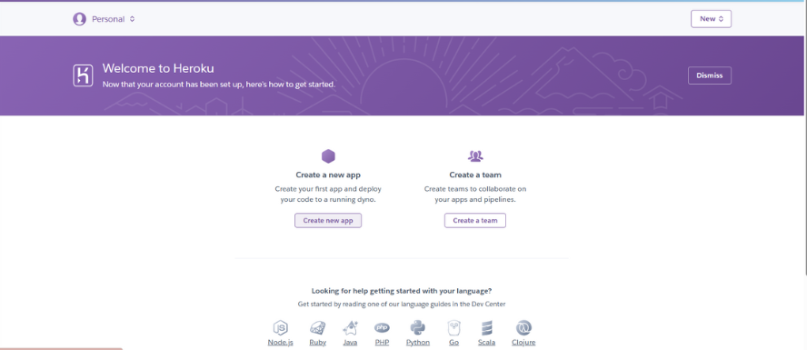

# Six Scoops
Six Scoops is a terminal-based alternative to a hangman game for kids. This game combines learning with fun. The player tries to guess a word letter by letter before running out of six scoops of ice cream. It is told the player that it is very hot and it is a good idea to get an ice cream. Playing this game is an effective way to encourage kids' interest in learning English. While playing this game, kids will learn easy vocabulary (100 words) about summer. The words contain 3 to 5 letters and are appropriate for young learners.

[Link to live site]()


## Planning

The following flowchart is created with [lucidchart](www.lucidchart.com). It visualizes the planning process for this application. Also, it was adited in PDF editor.


## Design

## User Stories

## Features

## Technologies Used

## Bugs

+ **Solved bugs**

1. The ```word_completion``` string looked like one line. And when the guessed letters joined it, letters sticked to each other. The text readability was very poor. So the user may have a bad experience.

  - *Solutions:* added spaces between each underscore character
## Testing

## Deployment

This project was deployed with [Heroku](https://dashboard.heroku.com) using Code Institute's mock terminal
as provided with the Python Essentials template.

1. This project requires you to have Python installed on your local PC.

2. Create a local copy of the GitHub repository by following one of the two processes below:

  - Go to the [GitHub Repo page](https://github.com/zhannamatuzak/six-scoops-ice-cream).

  - Click the Code button and download the ZIP file containing the project.
  - Extract the ZIP file to a location on your PC.
 
 3. Clone the repository:

   - Open a folder on your computer with the terminal.
   - Run the following command as on the screenshot below:
    (`git clone https://github.com/zhannamatuzak/six-scoops-ice-cream.git`)
 

 4. Install Python module dependencies:

   - Activate a virtual environment
    'python3 -m venv .venv' then '.venv .venv/bin/activate'

   - Run the command pip install -r requirements.txt:
    'pip install -r requirements.txt

 5. Create a [Heroku](https://dashboard.heroku.com) account (if not already existing) to host the project.

 6. Create a new app with Heroku:
 

 7. Write your project name. The repository name on GitHub and the Heroku app name do not need to be the same. 
    Then chose your region. If you still have not created  your own GitHub repository to host the code, do it now.

 

 8. You must add a Config Var provided by Code Institute for their student in Heroku's Settings.
    If you do not add this, then your deployment may fail.
 

   Also, you can store here your sensitive date, if you have.

  9. In Settings:
  
    - add two two buildpacks: Python and NodeJS.
    - Click "Add Buildpack" and choose. Then click "Save Changes".
    - Please note, that the order of buildpacks is important!

 
    
  10. Go to the Deploy section. Here you can choose the deployment method: 

    - Select GitHub;
    - Click "Connect to GitHub".

 
    - Search for your repository name by clicking "Search". 
    - Then click "Connect" to link your Heroku account to your repository code.
    - Scroll down the page. There are two opeions in this section:
      - set up autonatic deploys;
      - set up manually deploys.
    - If you choose automathic deploys, please click "Enable Automatic Deploys";
    - If you choose manually deploys, please click "Deploy Branch".
    - Wait for instalation.
    - Then you will se the message "Your app was successfully deployed".
    - Click the "View" button which takes to the deployed link.

## Credits

## Acknowledgements